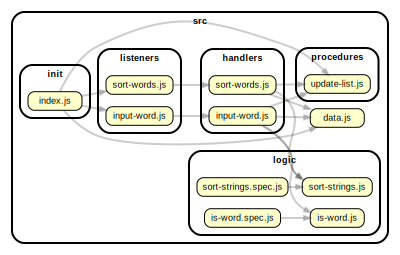

<!-- BEGIN TITLE -->

# DOCS

<!-- END TITLE -->

<!-- BEGIN TREE -->



<!-- END TREE -->

<!-- BEGIN TOC -->

- handlers
  - [input-word.js](#srchandlersinput-wordjs)
  - [sort-words.js](#srchandlerssort-wordsjs)
- init
  - [index.js](#srcinitindexjs)
- listeners
  - [input-word.js](#srclistenersinput-wordjs)
  - [sort-words.js](#srclistenerssort-wordsjs)
- logic
  - [is-word.js](#srclogicis-wordjs)
  - [sort-strings.js](#srclogicsort-stringsjs)
- procedures
  - [update-list.js](#srcproceduresupdate-listjs)
- [data.js](#srcdatajs)

<!-- END TOC -->

<!-- BEGIN DOCS -->

---

# /handlers

<details><summary><a href="../src/handlers/input-word.js" id="srchandlersinput-wordjs">src/handlers/input-word.js</a></summary>

<a name="handleInputWord"></a>

## handleInputWord

Entry point for users adding a word to the list.
It is called each time the user clicks the "add word" button.

| Param | Type               | Description                                          |
| ----- | ------------------ | ---------------------------------------------------- |
| event | <code>Event</code> | The event triggered when the user clicks the button. |

</details>

<details><summary><a href="../src/handlers/sort-words.js" id="srchandlerssort-wordsjs">src/handlers/sort-words.js</a></summary>

<a name="handleSortWords"></a>

## handleSortWords

Entry point for users sorting the list of words in this app.
It is called each time the input selection changes.

| Param | Type               | Description                                |
| ----- | ------------------ | ------------------------------------------ |
| event | <code>Event</code> | The event triggered by changing the input. |

</details>

---

[TOP](#DOCS)

---

# /init

<details><summary><a href="../src/init/index.js" id="srcinitindexjs">src/init/index.js</a></summary>

</details>

---

[TOP](#DOCS)

---

# /listeners

<details><summary><a href="../src/listeners/input-word.js" id="srclistenersinput-wordjs">src/listeners/input-word.js</a></summary>

</details>

<details><summary><a href="../src/listeners/sort-words.js" id="srclistenerssort-wordsjs">src/listeners/sort-words.js</a></summary>

</details>

---

[TOP](#DOCS)

---

# /logic

<details><summary><a href="../src/logic/is-word.js" id="srclogicis-wordjs">src/logic/is-word.js</a></summary>

<a name="isWord"></a>

## isWord ⇒ <code>boolean</code>

Checks if a string is a word. A word contains only letters.

**Returns**: <code>boolean</code> - Whether or not the text is a word.

| Param | Type                | Description                      |
| ----- | ------------------- | -------------------------------- |
| text  | <code>string</code> | A string to check for wordiness. |

**Example**

```js
isWord("cat"); // true
isWord("45"); // false
```

</details>

<details><summary><a href="../src/logic/sort-strings.js" id="srclogicsort-stringsjs">src/logic/sort-strings.js</a></summary>

<a name="sortStrings"></a>

## sortStrings ⇒ <code>Array.&lt;string&gt;</code>

Sorts an array of strings in different ways.
It does not modify the argument (no side-effects).

**Returns**: <code>Array.&lt;string&gt;</code> - a new sorted array containing the same strings as toSort

| Param      | Type                              | Default                                     | Description                                                                                                                                                                                                                                                                                                      |
| ---------- | --------------------------------- | ------------------------------------------- | ---------------------------------------------------------------------------------------------------------------------------------------------------------------------------------------------------------------------------------------------------------------------------------------------------------------- |
| [toSort]   | <code>Array.&lt;string&gt;</code> | <code>&#x27;&#x27;</code>                   | The array of strings to sort.                                                                                                                                                                                                                                                                                    |
| [sortType] | <code>string</code>               | <code>&quot;&#x27;oldest&#x27;&quot;</code> | How to sort the strings, 6 options. - oldest: from oldest to newest - newest: from newest to oldest - shortest: from shortest to longest - longest: from longest to shortest - a: alphabetical order - z: reverse alphabetical order if the sortType is not one of these 6 options, a copy of toSort is returned |

**Example**

```js
sortStrings(["cat", "arc", "bar"], (sortType = "a")); // ['arc', 'bar', 'cat']
```

</details>

---

[TOP](#DOCS)

---

# /procedures

<details><summary><a href="../src/procedures/update-list.js" id="srcproceduresupdate-listjs">src/procedures/update-list.js</a></summary>

<a name="updateList"></a>

## updateList

Renders an array of strings as an unordered list into the #list-container element

| Param      | Type                              | Default         | Description                               |
| ---------- | --------------------------------- | --------------- | ----------------------------------------- |
| [toRender] | <code>Array.&lt;string&gt;</code> | <code>[]</code> | an array of strings to render into the UI |

</details>

---

[TOP](#DOCS)

<details><summary><a href="../src/data.js" id="srcdatajs">src/data.js</a></summary>

<a name="data"></a>

## data

**Properties**

| Name  | Type                              | Description                                                         |
| ----- | --------------------------------- | ------------------------------------------------------------------- |
| words | <code>Array.&lt;string&gt;</code> | An array of words that the user has provided.                       |
| sort  | <code>string</code>               | A string indicating the order string should be displayed in the UI. |

</details>

<!-- END DOCS -->
