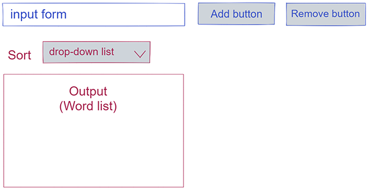

<!--

  you will write dev strategies in this module basically the same as in Incremental Developments
  the only difference is that there are now more types of tasks, for example:
    `type: css`
    `type: html`
    `type: logic`
    `type: handlers`
    `type: procedures`
    `type: listeners`
    `type: init`
    `type: data`
    ...

  a single user story may require a little bit of code in each of these folders
  it will take some time and practice to get used to this

-->

## Wireframe

Elements related to the **input** user story marked with blue stroke.
Elements related to the **sorting** user story marked with red stroke.

## Input words `for: input words`

### css `type: css`

- Size of the input field and buttons.
- Red color for warning message.

### html `type: html`

Input form <_form_>:

- Input field <_input name="text"_>
- Button Add <_input type="button" value="add" /_>
- Button Remove <_input type="button" value="remove" /_>

Warnings <_code id="warnings" class="warning"_><_/code_>

### logic `type: logic`

- _const isWord_: to test if input is a word (check every symbol for being a letter of latin alphabet). If it is not - send warning.

### handlers `type: handlers`

- _const handleInputWord_ - functional expression to add word in the list.

### procedures `type: procedures`

- update list _const updateList_ - function that renders an array of strings as an unordered list into the #list-container element.

### listeners `type: listeners`

- for input form with id 'input-form' to perform handleInputWord (event handler) triggered by 'click'.

### init `type: init`

- import listener for input word so it can attach to the DOM.

### data `type: data`

- _const data_ - object that contains:

- an array of words that the user has provided.
- a string indicating the order string should be displayed in the UI.

## Sort strings `for: sort strings`

### html `type: html`

- drop-down list <_select id="sort-type"_>
- <_options_> to choose with values: "oldest", "newest", "a", "z", "shortest", "longest".

### logic `type: logic`

Function that sorts an array of strings in different ways.

- oldest: from oldest to newest
- newest: from newest to oldest
- shortest: from shortest to longest
- longest: from longest to shortest
- a: alphabetical order
- z: reverse alphabetical order

### handlers `type: handlers`

- _const handleSortWords_ function that updates the list according to chosen algorithm ("oldest", "newest", "a", "z", "shortest", "longest").

### procedures `type: procedures`

- update list _const updateList_ - function that renders an array of strings as an unordered list into the #list-container element.

### listeners `type: listeners`

- for sort strings with id 'sort-type' to perform handleSortWords (event handler) triggered by 'change'.

### init `type: init`

- import listener for sort-words so it can attach to the DOM.

### data `type: data`

- _const data_ - object that contains:

- an array of words that the user has provided.
- a string indicating the order string should be displayed in the UI.
